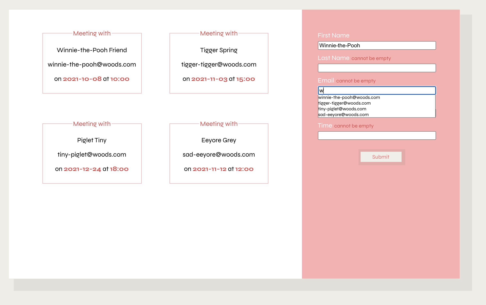

# devmentor.pl - React: Composition / Calendar

## Table of contents

-   [Overview](#overview)
    -   [The challenge](#the-challenge)
    -   [Screenshot](#screenshot)
    -   [How to run the project](#how-to-run-the-project)
-   [My process](#my-process)
    -   [Built with](#built-with)
    -   [What I learned](#what-i-learned)
    -   [Continued development](#continued-development)
    -   [Useful resources](#useful-resources)
-   [Author](#author)
-   [Acknowledgments](#acknowledgments)

## Overview

### The challenge

The goal was to create React Calendar with local API as a database to manage meetings. The calendar had to be rendered from the database and contain a form to submit new meetings (with specified validation of every field). Creating a autocomplete feature was an additional challenge after completing basic functionality. The autocomplete had to be based on previous meetings data and filter for data for every field.

### Screenshot



### How to open project

1. Clone git repository and open file on your local device in Code editor.
2. Run `npm install` command to install all npm packages.
3. Run `json-server --watch ./src/db/data.json --port 3005` command to run local API.
4. Run `npm start` command to open developer mode.

Localhost port: `http://localhost:3005/meetings`

## My process

This challenge taught me how to plan my composition in React and how to create my app with multiple components. Very important was to learn how to manage the state and how to pass data between the components using props. Additional task (creating autocomplete) was a bit challenging. I decided to start with getting the data out of JSON file for which I used [json-server documentation](https://github.com/typicode/json-server#operators) and implemented `GET /posts?title_like=server` operator. As a next step, I created a variable `suggestionsListComponent` where I mapped over an array containing suggestions for auto-complete.

```
suggestionsListComponent = (
                <ul className="suggestions">
                    {this.state.filteredSuggestions[0].map((suggestion) => {
                        let className;
                        return (
                            <li
                                className={className}
                                key={suggestion}
                                onClick={this.handleAutoComplete}
                            >
                                {suggestion}
                            </li>
                        );
                    })}
                </ul>
            );
```

A problem I had at that point was displaying autocomplete for every field at the same time. To maintain this issue I created a variable "activeField" in the state and update it while the user focuses on a particular input. To display autocomplete I had my `suggestionsListComponent` based on the condition of the activeField variable. To hide a list of suggestions I used onBlur event. However because onBlur event was fired before the user had a chance to navigate to the choice of autocomplete, I had to set the timeout function with a slight delay. To maintain a smooth transition between each field on focus I had to add a timeout function to `handleActiveField` function as well.

### Built with

-   React
-   rest API
-   CSS
-   Flexbox
-   Webpack

### What I learned

### Continued development

As an extra feature, I would like to do a search bar to filter meetings. I would like to refactor the app with React Hooks.

### Useful resources

-   [Official React website](https://reactjs.org/docs/getting-started.html) - Documentation. Every question regarding React answered.tag.

## Author

-   Frontend Mentor - [@Axseinga](https://www.frontendmentor.io/profile/yourusername)
-   LinkedIn - [Agnieszka Urbanowicz](https://www.linkedin.com/in/agnieszka-urbanowicz-051147151/)

## Acknowledgments

Thanks to my [Mentor - devmentor.pl](https://devmentor.pl/) - for providing me with this task and for code review.
